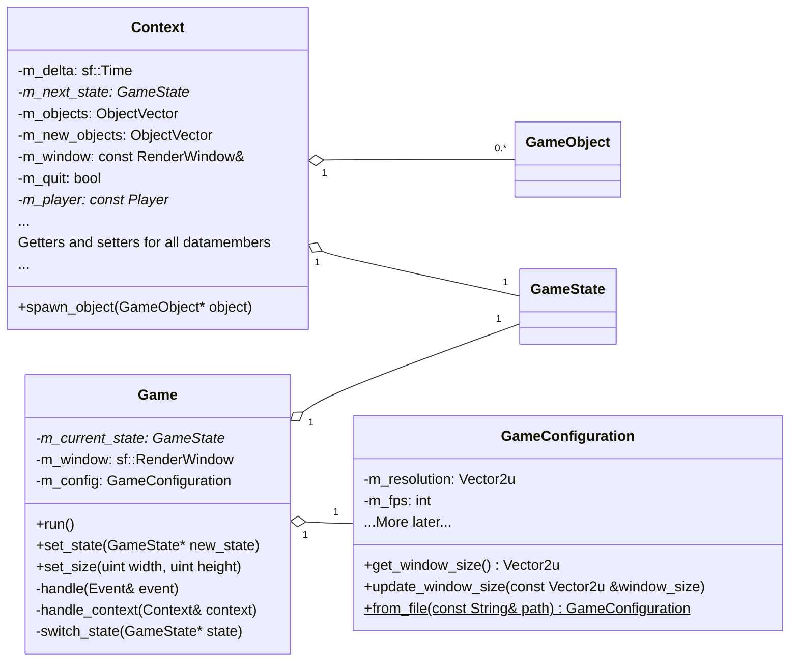
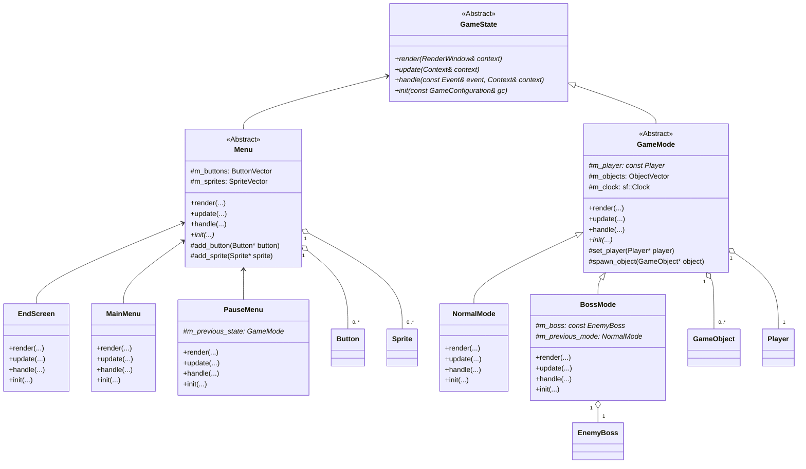
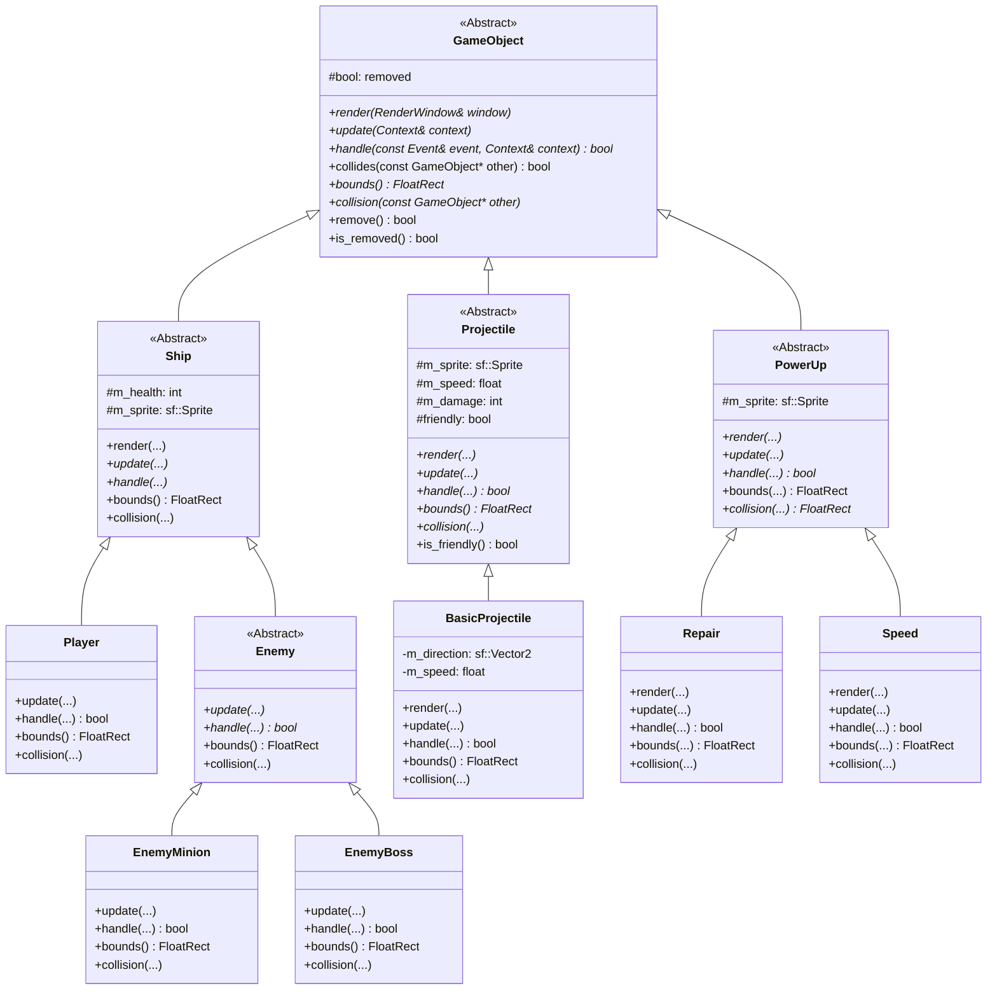
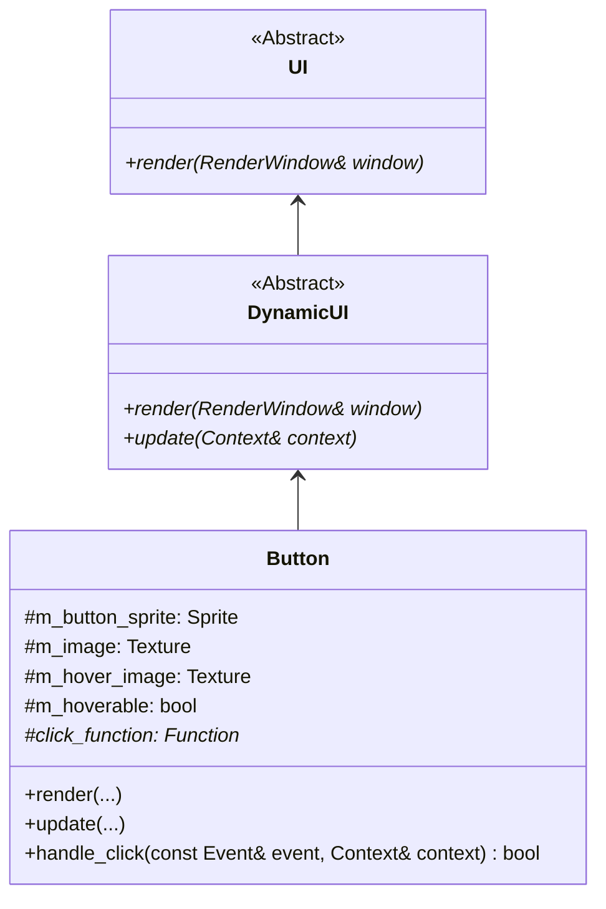
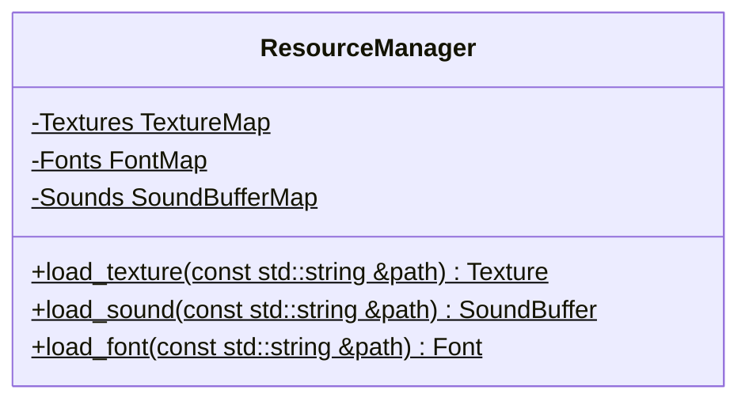

# Space Invader


## Installation

Kör följande i terminalen för att kompilera och starta spelet.

```terminal
make
./play
```

Notera att om [SFML](https://www.sfml-dev.org/index.php) inte är installerat globalt,
måste sökvägen till SFML nerladdningen anges i make-filen under variabeln `SF_ROOT`.
Detta ska inte behövas om datorerna på universitetet används.
Till exempel kan det se ut så här:

```makefile
SF_ROOT = C:/.../SFML
```

# Klassdiagram och CRC

Diagrammen nedan är skapade med [mermaid](https://mermaid-js.github.io/mermaid/#/).
Metoder och data markerade med `+` är public, medans de markerade med `-` är private
och `#` innebär att dem är protected. Kursiva metoder är virtuella. Understrukna
funktioner är statiska. `xxxxVector` är typedef till `std::vector<xxxx*>`, där xxxx
är GameObject, Button eller Sprite. På likande sätt är `xxxxMap` typefed till 
`std::map<std::string, xxxx>`.


## 1. Game, GameConfiguration och Context

<center>



</center>

- `Game` - klassen ansvarar för spelets huvud loop samt initialisera ett fönster.

- `Context` - en klass med all data som olika GameObjects och/eller GameStates kan
              komma att behöva. Utöver de listade datamedlemmarna i klassen, har Context dessutom getters och setters för datan.

- `GameConfiguration` - en klass som innehåller spelets konfiguration. Syftet med
                        klassen är att konfigurationen kan skapas genom att läsa
                        in en fil och därefter användas vid behov. Framförallt
                        när diverse GameStates ska initialiseras.

## 2. GameState

<center>



</center>

- `GameState` - en abstrakt (pure virtual) klass som beskriver publika gränssnittet
för ett GameState. Syftet med GameState är att enkelt kunna dela in spelet i separata och eventuellt oberoende delar
och därefter byta mellan dem vid behov.

- `Menu` - en klass som utökar GameState med data och funktionalitet som är gemensamt för de olika menyerna i spelet.

- `MainMenu/PausMenu/EnsScreen` - tre olika menyer. MainMenu visas när spelet startas och PausMenu visas när spelet pausas. EndScreen visas när spelet förloras.

- `GameMode` - en klass som utökar GameState med data och funktionalitet som är gemensamt för de olika spellägen i spelet.

- `NormalMode/BossMode` - två olika spellägen.

## 3. GameObject

<center>



</center>

- `GameObject` - en abstrakt klass som beskriver publika gränssnittet för ett GameObject.
Genom att ha en abstrakt GameObject klass som samtliga spelobjekt ärver ifrån och implementerar,
kan spelobjekten grupperas i t.ex. en array utan problem, vilket leder till enklare programmering.

## 4. UI

<center>



</center>

- `UI` - en abstrakt klass för användargränssnitt.

- `DynamicUI` - utökar UI med en update metod så den kan uppdateras varje frame.

- `Button` - en klass som beskriver en knapp som går att trycka på med musen.
             Kan exekvera en given funktion när knappen blir tryckt.

## 5. ResourceManager

<center>



</center>

- `ResourceManager` - en resurshanterare, som laddar in texturer, ljud och teckensnitt,
                      och sparar dem i en std::map så de endast laddas in en gång.
                      Inladdade resurser har dessutom statisk livslängd.
